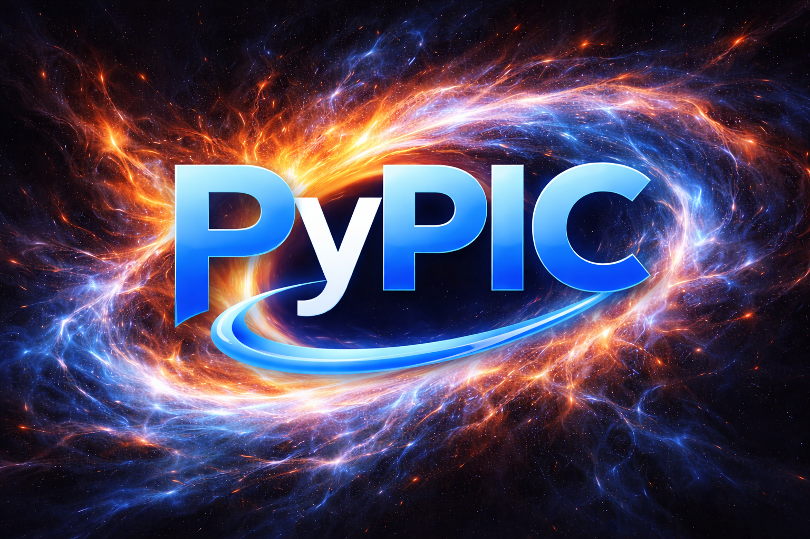

## Plasma Diamagnetism Model

From first principles with only a few charged particles, the diamagnetism of a system of mobile charges makes its presence seem obvious via Lenz's law.

In the case of many-particle interactions, the phenomenon known as diamagnetism becomes much less rigidly defined, shifting to more of a lens from which to analyze a system.

This project was made to provide a structure accommodating the study of diamagnetism without the use of plasma fluid models or kinetic theory.

## Disclaimer

This project is currently just a PyCharm project uploaded to Github, and must stay that way for now. PyPIC3D's official PyPi release is nonfunctional, and part of the convenience of this project is its manual inclusion into PyCharm under its most recent Github commit (which is functional, of course).

Be very careful not to install PyPIC3D via any automatic means, or else things will break very quickly.

## How to Use

To run a simulation, go into the `demos` folder and pick a demonstration. In each folder you'll find a `.toml` file, which are this tool's config files. Their contents are somewhat self-explanatory, and their parameters can be adjusted freely to configure your simulation.

# External B-field Implementation

It is possible but rather involved to configure an external B-field for your simulation, and doing so is crucial to any demonstration of diamagnetic behavior. All demos with an external B-field (all of them except for `two-stream`) have a region at the bottom of their config (`toml`) file dedicated to them. Here you can add dedicated NumPy filenames whose corresponding files must contain a component of the field as a 3-layer matrix `B_component[x_index][y_index][z_index]`.

Due to the roughness of creating such a representation of the external B-field, each demo with one of them has a Python file dedicated to the creation of their NumPy arrays. So far, I haven't made a methodical way to do this.

In the wire-loop demonstration, the external B-field was modeled by numerically calculating the Biot-Savart integral on a mesh of points with the same grid shape as that of the PyPIC3D fields (stated as (Nx, Ny, Nz in the config files).

One of my future goals with this project is to implement a low-effort arbitrary external B-field inclusion method.


## PyPIC3D Simulation Tool

PyPIC3D IS NOT MY WORK. Please go to https://github.com/uwplasma/PyPIC3D for the official commit of this phenomenal tool. Its README is included here for convenience, as a large portion of this project is done with its functionality.


<div align="center">
  
</div>

## PyPIC3D

PyPIC3D is a 3D particle-in-cell (PIC) plasma simulation code written in Python with JAX.
It is built around a config-driven CLI workflow:

```bash
PyPIC3D --config path/to/config.toml
```

## What It Does

- Advances charged particle species with a Boris particle pusher.
- Deposits current with either `j_from_rhov` or `esirkepov`.
- Evolves fields with a first-order Yee electrodynamic update or an electrostatic Poisson solve.
- Writes diagnostics, VTK outputs, and optional openPMD files.

## Installation

From PyPI:

```bash
pip install PyPIC3D
```

From source:

```bash
git clone <repo-url>
cd PyPIC3D
pip install .
```

For development:

```bash
pip install -e .
```

## Quick Start

Run a packaged demo from the repository root:

```bash
PyPIC3D --config demos/two_stream/two_stream_plus_fields.toml
```

Simulation outputs are written to `<output_dir>/data` (default: current working directory).

## Documentation Map

Primary docs live in `docs/` (Sphinx + reStructuredText):

- `docs/index.rst`: doc entry point and navigation.
- `docs/usage.rst`: runtime configuration and CLI behavior.
- `docs/solvers.rst`: electrodynamic/electrostatic update paths.
- `docs/chargeconservation.rst`: current deposition methods.
- `docs/grid.rst`: grid layouts and boundary model.
- `docs/particles.rst`: species model and initialization.
- `docs/demos.rst`: demo catalog and run commands.
- `docs/architecture.rst`: module-level architecture and data flow.
- `docs/development.rst`: setup, tests, docs build, debugging notes.
- `docs/contributing.rst`: contribution workflow.

## Repository Layout

```text
PyPIC3D/
  __main__.py              # CLI entrypoint
  initialization.py        # config/defaults + world/fields/particles setup
  evolve.py                # per-step simulation loops
  particle.py              # particle species model + initialization
  J.py                     # current deposition methods
  rho.py                   # charge deposition
  solvers/                 # field solvers and operators
  diagnostics/             # plotting, VTK, openPMD writers
  utils.py                 # config, IO, helper math/utilities

demos/                     # runnable example configurations
tests/                     # pytest suite
```

## Testing

```bash
pytest
```

## Build Docs

```bash
pip install -r docs/requirements.in
sphinx-build -b html docs docs/_build/html
```

## License

MIT. See `LICENSE`.
